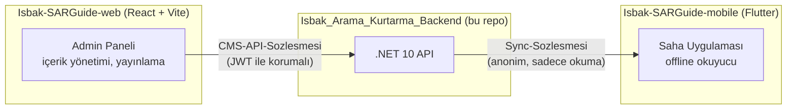

# Kentsel Arama Kurtarma El Kitabı — Backend

Kentsel arama-kurtarma (USAR) ekipleri için offline-first bir saha el kitabı uygulamasının backend'i. İki tüketicisi var:

- **Mobil uygulama** (Flutter) — tamamen anonim, internetsiz çalışan, sahada kullanılan okuyucu.
- **Admin web paneli** — kimlik doğrulamalı bir CMS; içerik editörleri ve yöneticiler kitabı burada oluşturur/düzenler/yayınlar.

Backend, .NET 10 üzerinde katı bir 4-katmanlı N-Tier mimariyle yazılmış bir REST API.

## İçindekiler

- [Ekosistem — Üç Repo, Tek Sistem](#ekosistem--üç-repo-tek-sistem)
- [Özellikler](#özellikler)
- [Teknoloji Yığını](#teknoloji-yığını)
- [Mimari — Özet](#mimari--özet)
- [Hızlı Başlangıç](#hızlı-başlangıç)
- [Test Çalıştırma](#test-çalıştırma)
- [Proje Yapısı](#proje-yapısı)
- [Dokümantasyon](#dokümantasyon)

## Ekosistem — Üç Repo, Tek Sistem

Bu backend tek başına çalışan bir servis değil — biri onu yöneten, diğeri onu sahada
okuyan iki ayrı istemciyle birlikte bir bütün oluşturur. Üçü de ayrı repo, ayrı
teknoloji yığını, ama **tek bir sözleşme çifti** üzerinden konuşuyorlar:



| Repo | Teknoloji | Rolü |
|---|---|---|
| **`Isbak_Arama_Kurtarma_Backend`** (bu repo) | .NET 10 / PostgreSQL | Tek doğru kaynak: içerik, yayın geçmişi, kimlik doğrulama. Diğer ikisi bu API olmadan hiçbir şey yapamaz. |
| **`Isbak-SARGuide-web`** | React 19 + Vite + Tailwind 4, `@dnd-kit` (sürükle-bırak sıralama), `dompurify` | Admin/editör kullanıcılarının kitabı düzenlediği, yayınladığı CMS paneli — [`CMS-API-Sozlesmesi.md`](docs/CMS-API-Sozlesmesi.md)'i tüketir. |
| **`Isbak-SARGuide-mobile`** | Flutter, `sqflite` (yerel SQLite), `http`, tamamen anonim | Sahadaki personelin kullandığı, tamamen offline çalışan okuyucu — [`Sync-Sozlesmesi.md`](docs/Sync-Sozlesmesi.md)'yi tüketir. |

**Neden ayrı sözleşmeler:** web paneli kimlik doğrulamalı, yazma yetkisine sahip, her
zaman internetli bir istemci; mobil ise anonim, sadece-okur, çoğu zaman internetsiz bir
istemci. İkisinin ihtiyacı temelden farklı olduğu için tek bir "genel API" yerine iki
ayrı, kendi kullanım şekline göre tasarlanmış sözleşme var — bu ayrım [`Mimari.md`](docs/Mimari.md)'de
daha ayrıntılı anlatılıyor. Web ve mobil repoların kendi iç mimarisi bu dokümantasyonun
kapsamı dışında; burada sadece backend'le nasıl konuştukları ele alınıyor.

## Özellikler

- **İçerik yönetimi (CMS):** Kitap → Modül (kategori) → İçerik (konu) → İçerik Bloğu hiyerarşisi; sürükle-bırak sıralama, medya yükleme (magic-byte doğrulaması + otomatik WebP dönüşümü + thumbnail üretimi).
- **Yayın/rollback sistemi:** Taslak içerik, admin "Yayınla" demeden mobile hiç ulaşmaz. Yayınlar immutable, sürümlenmiş anlık görüntüler olarak saklanır — istenirse eski bir sürüme geri dönülebilir (rollback), yayınlanmadan önce ne değişeceğini gösteren bir önizleme (`preview`) var.
- **Offline-first mobil senkronizasyon:** Mobil cihazlar tam bir anlık görüntü (`/sync/snapshot`) veya sadece değişen kısmı (`/sync/changes`, delta) indirebilir. Bütünlük SHA-256 checksum'larla doğrulanır.
- **Kimlik doğrulama:** JWT access/refresh token rotasyonu, çalıntı token tespiti, başarısız giriş kilitlemesi, rol tabanlı yetkilendirme (Admin/Editor).
- **Üretime hazırlık:** Health check'ler, güvenlik başlıkları, HSTS, response compression, rate limiting, çok aşamalı Docker imajı, GitHub Actions CI/CD.

## Teknoloji Yığını

| Katman | Teknoloji |
|---|---|
| Runtime | .NET 10 |
| Web framework | ASP.NET Core (Minimal hosting, Controller tabanlı) |
| Veritabanı | PostgreSQL 18 |
| ORM | Entity Framework Core (Code-First, Npgsql) |
| Kimlik doğrulama | ASP.NET Core Identity + JWT Bearer |
| Nesne eşleme | Mapster |
| Doğrulama | FluentValidation |
| Görsel işleme | SkiaSharp |
| Test | xUnit, Shouldly, Testcontainers (gerçek Postgres ile entegrasyon testleri) |
| API dokümantasyonu | OpenAPI + Scalar UI (Development ortamında) |
| CI/CD | GitHub Actions → `ghcr.io` |

## Mimari — Özet

```
Isbak_SAR_Guide.API → Isbak_SAR_Guide.Business → Isbak_SAR_Guide.DataAccess → Isbak_SAR_Guide.Entities
```

Tek yönlü bağımlılık; API katmanı DataAccess'e asla doğrudan referans vermez. Servisler beklenen hatalar için exception fırlatmaz, `Result<T>` deseni kullanılır. Detaylı mimari kararlar ve gerekçeleri için → **[`docs/Mimari.md`](docs/Mimari.md)**.

## Hızlı Başlangıç

### Önkoşullar

- [.NET 10 SDK](https://dotnet.microsoft.com/download) (`10.0.400` — bkz. `global.json`)
- [Docker Desktop](https://www.docker.com/products/docker-desktop/) (yerel PostgreSQL için)

### Adımlar

```bash
# 1. PostgreSQL'i ayağa kaldır (db=isbak_sar_guide, user/pass=postgres/postgres, port 5432)
docker compose up -d

# 2. Veritabanı şemasını uygula
dotnet ef database update --project Isbak_SAR_Guide.DataAccess --startup-project Isbak_SAR_Guide.API

# 3. API'yi çalıştır (http://localhost:5007)
cd Isbak_SAR_Guide.API
dotnet run
```

Development ortamında API ayağa kalktığında:
- **Scalar API dokümantasyonu:** `http://localhost:5007/scalar`
- Development seed'i otomatik çalışır ve örnek kitap otomatik yayınlanır — `/sync/*` uçları ek bir admin adımı gerekmeden hemen test edilebilir.

Hazır örnek istekler için `Isbak_SAR_Guide.API/Isbak_SAR_Guide.API.http` dosyasına bakın (VS Code REST Client uzantısıyla doğrudan çalıştırılabilir).

### Yeni bir migration eklerken

```bash
dotnet ef migrations add <Ad> --project Isbak_SAR_Guide.DataAccess --startup-project Isbak_SAR_Guide.API
dotnet ef database update --project Isbak_SAR_Guide.DataAccess --startup-project Isbak_SAR_Guide.API
```

İki proje her zaman birlikte belirtilir — dosyalar `DataAccess`'te tutulur, konfigürasyon/DI `API`'de.

## Test Çalıştırma

```bash
dotnet test
dotnet test --filter "FullyQualifiedName~AuthTests"                              # tek bir test sınıfı
dotnet test --filter "LoginAsync_WithValidCredentials_ReturnsOkWithAccessToken"  # tek bir test
```

Entegrasyon testleri (`tests/Isbak_SAR_Guide.Tests/Integration/`), Testcontainers ile **gerçek bir Postgres container'ı** otomatik ayağa kaldırır — Docker'ın çalışıyor olması yeterli, elle bir veritabanı kurulumu gerekmez.

## Proje Yapısı

```
Isbak_SAR_Guide.API/          Controller'lar, middleware, DI kayıtları
Isbak_SAR_Guide.Business/     Servisler, DTO'lar, doğrulama, Result<T>
Isbak_SAR_Guide.DataAccess/   Repository'ler, EF Core konfigürasyonları, migration'lar
Isbak_SAR_Guide.Entities/     Domain modelleri, enum'lar
tests/                        Birim + entegrasyon testleri
docs/                         Mimari, veritabanı, API sözleşmeleri, kullanıcı kılavuzları
storage/                      Yerel medya depolama kökü (dev)
```

## Dokümantasyon

| Doküman | Ne için |
|---|---|
| [`docs/Mimari.md`](docs/Mimari.md) | Katman mimarisi, tasarım desenleri, publish/rollback akışı |
| [`docs/Veritabani.md`](docs/Veritabani.md) | Tüm entity'ler, index'ler, migration geçmişi, ER diyagramı |
| [`docs/CMS-API-Sozlesmesi.md`](docs/CMS-API-Sozlesmesi.md) | Admin/CMS REST API sözleşmesi (web ekibi için) |
| [`docs/Sync-Sozlesmesi.md`](docs/Sync-Sozlesmesi.md) | Mobil offline-sync API sözleşmesi (mobil ekip için) |
| [`docs/Kullanici-Kilavuzu-Admin.md`](docs/Kullanici-Kilavuzu-Admin.md) | CMS panelini kullanan admin/editörler için kılavuz |
| [`docs/Kullanici-Kilavuzu-Saha.md`](docs/Kullanici-Kilavuzu-Saha.md) | Mobil uygulamayı sahada kullananlar için kılavuz |
| [`docs/Deployment.md`](docs/Deployment.md) | Prod Docker imajı, ortam değişkenleri, CD iş akışı |

---

*Bu README'nin kurulum adımları [`CLAUDE.md`](CLAUDE.md)'deki doğrulanmış komutlarla birebir eşleşir.*
