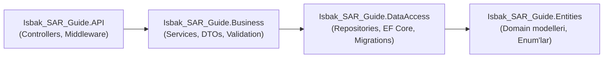
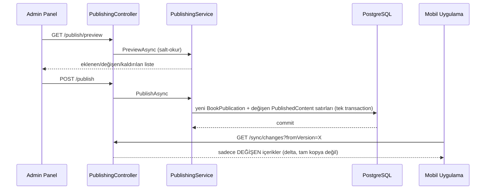

# Mimari

## İçindekiler

1. [Katman Mimarisi](#katman-mimarisi)
2. [Klasör Kuralı — Tip-Önce](#klasör-kuralı--tip-önce)
3. [Kullanılan Tasarım Desenleri](#kullanılan-tasarım-desenleri)
4. [Bilinçli Olarak Kullanılmayan Desenler](#bilinçli-olarak-kullanılmayan-desenler)
5. [`Result<T>` — Beklenen Hatalar İçin Exception Yok](#resultt--beklenen-hatalar-için-exception-yok)
6. [Auth: Deny-by-Default](#auth-deny-by-default)
7. [İçerik Modeli ve Offline Senkronizasyon](#i̇çerik-modeli-ve-offline-senkronizasyon)
8. [Publish / Rollback Akışı](#publish--rollback-akışı)
9. [Bilinen Sınırlar](#bilinen-sınırlar)

---

## Ekosistemdeki Yeri

Bu doküman sadece bu repodaki (.NET backend) mimariyi anlatır. Backend, ayrı repolarda
yaşayan iki istemcinin ortak omurgasıdır: **`Isbak-SARGuide-web`** (React, admin CMS —
JWT ile korumalı [`CMS-API-Sozlesmesi.md`](CMS-API-Sozlesmesi.md) uçlarını
kullanır) ve **`Isbak-SARGuide-mobile`** (Flutter, tamamen anonim saha okuyucusu —
[`Sync-Sozlesmesi.md`](Sync-Sozlesmesi.md) uçlarını kullanır). Bu iki sözleşmenin
ayrı tutulmasının nedeni, iki istemcinin temelden farklı ihtiyaçları: web her zaman
internetli + yazma yetkili, mobil çoğu zaman internetsiz + sadece-okur. Ekosistemin tam
resmi için → [`README.md`](../README.md#ekosistem--üç-repo-tek-sistem).

## Katman Mimarisi

Katı 4-katmanlı N-Tier, tek yönlü bağımlılık:



**Katı kural:** API katmanı `DataAccess`'e **asla** doğrudan referans vermez (ne `ProjectReference` ne `using`). Her katman DI (`Microsoft.Extensions.DependencyInjection` namespace'inde, bilerek kendi namespace'inde değil) altında tek bir extension metodu sunar: `AddDataAccess()`, `AddBusiness()`, `AddApiAuthentication()`. Böylece bir katman implementasyonun fiziksel olarak nerede olduğunu bilmek zorunda kalmaz.

## Klasör Kuralı — Tip-Önce

`Business` ve `DataAccess` klasörleri **özelliğe göre değil, tipe göre** organize edilir:

```
Business/DTOs/{Ozellik}/            Business/Validation/{Ozellik}/
Business/Services/Abstract/         Business/Services/Concrete/
DataAccess/Repositories/Abstract/   DataAccess/Repositories/Concrete/
```

Arayüzler ve implementasyonlar her zaman ayrı `Abstract`/`Concrete` klasörlerinde durur — ekstra bir `using` maliyetine rağmen. Bu, proje ortasında bilinçli bir yeniden yapılandırmaydı (bkz. roadmap §2.1).

## Kullanılan Tasarım Desenleri

| Desen | Nerede | Neden |
|---|---|---|
| **Repository + Unit of Work** | `DataAccess/Repositories/` | Tüm repository'ler tek bir `DbContext` paylaşır — `PublishingService.PublishAsync` gibi çoklu-tablo işlemleri tek transaction'da commit edilir |
| **`Result<T>`** | `Business/Common/Result.cs` | Beklenen hatalar (bulunamadı, doğrulama, çakışma) için exception yerine tip-güvenli dönüş değeri |
| **DTO (record) + Mapster** | Her `Business/DTOs/{Ozellik}/` | Entity'leri API sınırının dışına sızdırmamak, otomatik property eşleme |
| **Options Pattern** | `StorageOptions`, `JwtOptions`, `GlobalRateLimitOptions`, vb. | Tip-güvenli, doğrulanabilir konfigürasyon |
| **Strategy** | `IStorageService` / `LocalFileStorageService` | MinIO gibi bir depolama sağlayıcısına geçiş tek bir yeni sınıf, başka hiçbir yer değişmez |
| **Middleware (Global Exception Handling)** | `GlobalExceptionHandler.cs` | Beklenmeyen exception'lar için TEK, merkezi RFC 7807 ProblemDetails üretimi |

## Bilinçli Olarak Kullanılmayan Desenler

Bu proje şu desenleri **kasıtlı olarak** kullanmıyor — eksiklik değil, ölçeğe göre bilinçli bir tercih:

- **CQRS / MediatR** — komut/sorgu ayrımının getirdiği dolaylılık, bu ölçekte (tek takım, orta karmaşıklıkta iş kuralları) karşılığını vermiyor.
- **Domain Events** — entity'ler arası olay tabanlı iletişime ihtiyaç doğmadı; `PublishingService`'in tek transaction'lı yaklaşımı yeterli.
- **Generic `IEntity`/`IAuditable` mega-hiyerarşisi** — `BaseEntity` zaten ortak alanları taşıyor, daha soyut bir hiyerarşi gereksiz dolaylılık ekler.
- **Specification Pattern** — repository'lerin sorgu ihtiyaçları, gerçek bir kullanım ortaya çıktıkça (`GetWithFullTreeAsync` gibi) doğrudan eklendi; genel bir sorgu-nesnesi soyutlaması YAGNI ihlali olurdu.
- **AutoMapper** — Mapster tercih edildi (daha az konfigürasyon, derleme zamanı kod üretimi).

## `Result<T>` — Beklenen Hatalar İçin Exception Yok

Servisler beklenen hatalar (bulunamadı, doğrulama, yanlış kimlik bilgisi) için **asla exception fırlatmaz**. `Result` / `Result<T>` döner (`Business/Common/Result.cs`). `Error` (`Business/Common/Error.cs`) bir `ErrorType` taşır (`Validation`/`NotFound`/`Conflict`/`Unauthorized`/`Forbidden`/`Unexpected`), `ResultExtensions.ToActionResult()` (`API/Extensions/ResultExtensions.cs`) bunu doğru HTTP durum kodu + `ProblemDetails`'e çevirir. Controller'lar her zaman bu kadar ince kalır:

```csharp
var result = await service.DoThingAsync(...);
return result.ToActionResult(this);
```

Gerçekten beklenmeyen exception'lar, `Middleware/GlobalExceptionHandler.cs` (`IExceptionHandler`) tarafından **tek bir yerde**, global olarak yakalanır — controller başına try/catch eklenmez.

## Auth: Deny-by-Default

`AddApiAuthentication()`, kimliği doğrulanmış bir kullanıcı gerektiren bir `FallbackPolicy` kurar — `[Authorize]`/`[AllowAnonymous]` işaretlenmemiş **her** endpoint otomatik olarak korunur. Sadece `SyncController` (mobil, ürün gereği tamamen anonim) ve `AuthController`'ın login/refresh/revoke aksiyonları `[AllowAnonymous]` taşır.

`PublishingController` ayrıca Admin **rolünü** zorunlu kılar (`[Authorize(Roles = RoleNames.Admin)]`) — Editor'lar içerik düzenler ama yayınlayamaz; yayınlamak sahadaki cihazlara ulaşan şeyi değiştirir.

## İçerik Modeli ve Offline Senkronizasyon

Alan modeli: `Book → Module → Content → ContentBlock (→ Media)`. Detaylı şema için [`Veritabani.md`](Veritabani.md).

`BookPublication` / `PublishedContent`, taslak ağacından **ayrı, immutable** tablolardır — sürümlenmiş yayın anlık görüntülerini tutar. `PublishingService.PublishAsync`, taslak ağacını tek bir transaction'da dondurur: yeni versiyon = `max(Version) + 1`, her değişen içerik için bir `PublishedContent` satırı (kanonik `PayloadJson` + checksum), artık var olmayan içerikler için tombstone satırları (**tam olarak bir kez** yazılır), ve tüm manifest `ManifestJson`'a donar.

**Kanonik serileştirme — DONDURULMUŞ:** `SnapshotBuilder` (`Business/Mapping/`), hem yayın hem senkron için TEK doğru kaynak. `CanonicalOptions`'ı (camelCase + `UnsafeRelaxedJsonEscaping`) **asla değiştirilmemeli** — her değişiklik yayınlanmış her checksum'ı geçersiz kılar. Evrensel değişmez: her `PublishedContent` satırı `Checksum = SHA256(PayloadJson)`'ı sağlar, tombstone'lar dahil.

## Publish / Rollback Akışı



**Rollback**, geçmişi silmez — eski bir `SnapshotJson`'ı **yeni bir versiyon numarasıyla** yeniden yayınlar (git `revert`'e benzer: eski içerik, yeni commit). Versiyon numaraları **asla geriye gitmez veya yeniden kullanılmaz** — `(BookId, Version)` üzerindeki unique constraint bunu veritabanı seviyesinde garanti eder. Bunun nedeni: mobil senkronizasyonun `fromVersion > X` karşılaştırmasının doğru çalışması için versiyon numaralarının **monotonik ve asla tekrarlanmayan** bir dizi olması gerekir — aksi halde daha önce senkronize olmuş bir cihaz, yeniden kullanılan bir versiyon numarasını "zaten güncelim" sanıp gerçek değişiklikleri hiç görmeyebilir.

Rollback, **CMS taslak ağacına hiç dokunmaz** — sadece mobilin senkronize ettiği yayın verisini değiştirir. Rollback'ten sonra normal "Yayınla" yapılırsa, taslak (rollback'ten etkilenmemiş) yeniden yayınlanır ve rollback'in etkisi geri alınır — bu bilinçli bir tasarım, hata değil.

## Bilinen Sınırlar

- **Video/Animasyon medya yükleme henüz desteklenmiyor.** `MediaType`/`ContentBlockType` enum'larında `Video`/`Animation` değerleri var ama `MediaService.UploadAsync` sadece PNG/JPEG/GIF/WEBP imzalarını tanıyor; bir video dosyası `400 Media.UnsupportedFormat` ile reddedilir.
- **GIF istisnası (2026-09-03 düzeltildi):** Yüklenen her görsel mobil optimizasyonu için WebP'ye çevrilir — **GIF hariç**, çünkü SkiaSharp'ın decode katmanı animasyonlu bir GIF'in sadece ilk karesini okur; GIF artık orijinal baytlarıyla (animasyonu korunarak) saklanıyor.
- **Kategori hiyerarşisi tek seviyeli.** `Module` (kategori) şu an kendine referans veremiyor — alt kategori (e-ticaret sitelerindeki gibi bir ağaç) desteklenmiyor. Planlı bir gelecek özelliği, henüz uygulanmadı.
- **`PublishedContent` tablosu sınırsız büyür.** Her yayın/rollback, değişen içerik kadar yeni satır ekler, hiçbir satır asla silinmez (immutable ledger tasarımı). `(BookId, ContentId, Version)` index'i sorgu maliyetini kontrol altında tutuyor, ama bir budama/arşivleme politikası henüz yok.

---

*Bu doküman [`Veritabani.md`](Veritabani.md) ile birlikte okunmalı. API sözleşmeleri
için → [`CMS-API-Sozlesmesi.md`](CMS-API-Sozlesmesi.md) ve
[`Sync-Sozlesmesi.md`](Sync-Sozlesmesi.md).*
