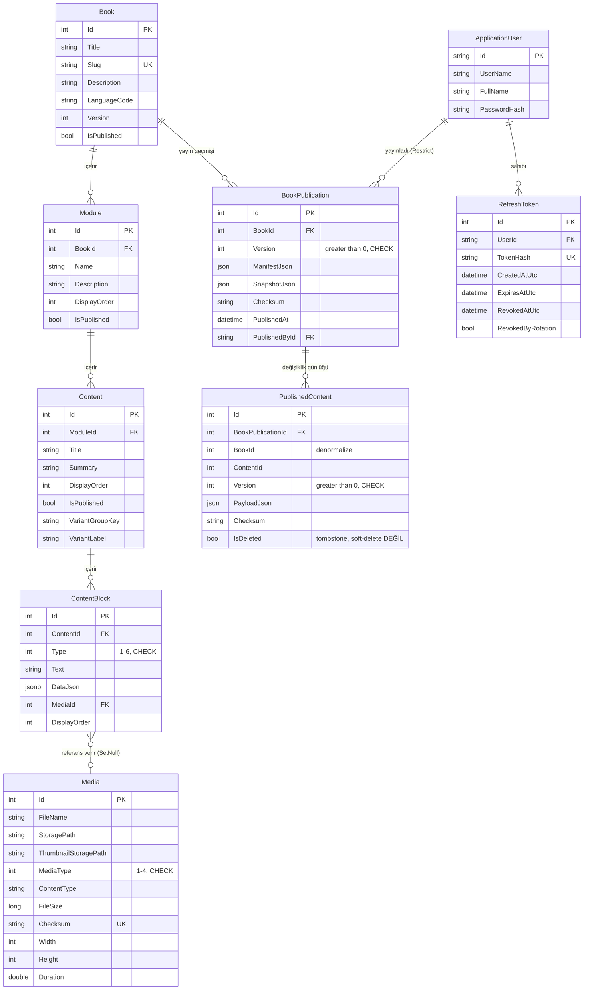

# Veritabanı Şeması

PostgreSQL üzerinde EF Core Code-First yaklaşımıyla yönetilen şema. Migration dosyaları `Isbak_SAR_Guide.DataAccess/Migrations/`, entity tanımları `Isbak_SAR_Guide.Entities/`, EF Core konfigürasyonları `Isbak_SAR_Guide.DataAccess/Configurations/` altındadır.

## İçindekiler

1. [ER Diyagramı](#er-diyagramı)
2. [Ortak Alanlar — `BaseEntity`](#ortak-alanlar--baseentity)
3. [Entity Referansı](#entity-referansı)
4. [Enum'lar](#enumlar)
5. [Soft Delete Davranışı](#soft-delete-davranışı)
6. [Migration Geçmişi](#migration-geçmişi)
7. [Repository Deseni](#repository-deseni)

---

## ER Diyagramı



**Diyagramda dikkat çeken nokta:** `Book → Module → Content → ContentBlock → Media` zinciri normal bir soft-delete'li ağaç. Ama `BookPublication`, `PublishedContent` ve `RefreshToken` **bilerek `BaseEntity`'den türemiyor** — bunlar immutable (değiştirilemez) kayıtlar, "soft delete" kavramı onlar için anlamsız. Aşağıdaki [Soft Delete Davranışı](#soft-delete-davranışı) bölümü bunu detaylandırıyor.

---

## Ortak Alanlar — `BaseEntity`

`Book`, `Module`, `Content`, `ContentBlock`, `Media` — bu 5 entity `BaseEntity`'den türer ve şu alanları paylaşır:

| Alan | Tip | Açıklama |
|---|---|---|
| `Id` | `int` | Primary key |
| `CreatedAt` | `DateTime` | `SaveChanges` tarafından otomatik damgalanır |
| `UpdatedAt` | `DateTime` | Her `SaveChanges`'te otomatik güncellenir |
| `IsDeleted` | `bool` | Soft-delete bayrağı |
| `DeletedAt` | `DateTime?` | Silinme zamanı (varsa) |

`BookPublication`, `PublishedContent`, `RefreshToken` bu alanları **taşımaz** — kendi immutable alan setlerine sahiptir (aşağıda ayrıca listelenmiştir).

---

## Entity Referansı

### `Book`

| Alan | Tip | Notlar |
|---|---|---|
| `Title` | `string(200)`, zorunlu | |
| `Slug` | `string(200)`, zorunlu | **Unique** |
| `Description` | `string(2000)?` | |
| `LanguageCode` | `string(10)`, zorunlu | Varsayılan `"tr"` |
| `Version` | `int` | Son yayın sürümü (yayınlanmadıysa 0) |
| `IsPublished` | `bool` | "Bu kitap en az bir kez yayınlandı mı" — taslak kapısı değil |

**Index:** `Slug` — unique.
**Query filter:** `!IsDeleted`.

### `Module` (Kategori)

| Alan | Tip | Notlar |
|---|---|---|
| `BookId` | `int`, FK | `Book`, `OnDelete: Cascade` |
| `Name` | `string(200)`, zorunlu | |
| `Description` | `string(2000)?` | |
| `DisplayOrder` | `int` | Otomatik atanır (`MAX+1`), silme sonrası yeniden numaralandırılır |
| `IsPublished` | `bool` | |

**Index:** `(BookId, DisplayOrder)` — **unique, partial** (`WHERE "IsDeleted" = false`). İki modül aynı kitapta aynı pozisyonu iddia edemez; silinmiş modüller bu kısıttan muaf.
**Query filter:** `!IsDeleted`.

### `Content` (İçerik / Konu)

| Alan | Tip | Notlar |
|---|---|---|
| `ModuleId` | `int`, FK | `Module`, `OnDelete: Cascade` |
| `Title` | `string(200)`, zorunlu | |
| `Summary` | `string(500)?` | |
| `DisplayOrder` | `int` | Modül içindeki sıra |
| `IsPublished` | `bool` | |
| `VariantGroupKey` | `string(100)?` | Aynı başlık altında birden fazla varyantı olan bir grubu işaretler (örn. F8/F9/TH/ABK düğüm türleri) |
| `VariantLabel` | `string(50)?` | Grup içindeki kısa sekme etiketi |

**Index 1:** `(ModuleId, DisplayOrder)` — unique, partial (`WHERE "IsDeleted" = false`).
**Index 2:** `(ModuleId, VariantGroupKey)` — partial (`WHERE "VariantGroupKey" IS NOT NULL`), unique değil.
**Query filter:** `!IsDeleted`.

### `ContentBlock` (İçerik Bloğu)

| Alan | Tip | Notlar |
|---|---|---|
| `ContentId` | `int`, FK | `Content`, `OnDelete: Cascade` |
| `Type` | `int` (enum `ContentBlockType`) | **CHECK:** `Type BETWEEN 1 AND 6` |
| `Text` | `string?` | Text/Warning blokları için |
| `DataJson` | `jsonb?` | Table/Warning gibi yapısal veri — checksum sözü yok, serbestçe yeniden yazılabilir |
| `MediaId` | `int?`, FK | `Media`, **`OnDelete: SetNull`** |
| `DisplayOrder` | `int` | |

**Index:** `(ContentId, DisplayOrder)` — unique değil (ContentBlock'ta pozisyon çakışması engeli yok, diğer ikisinden farklı).
**Query filter:** `!IsDeleted`.

> **Not:** `MediaId` FK'sinin `SetNull` davranışı, sadece medya **gerçekten** silindiğinde (hard delete) tetiklenir. Soft-delete bir `DELETE` üretmediği için, bir `Media` satırı soft-delete edildiğinde ona referans veren bloklar `MediaId`'lerini kaybetmez — bu yüzden `MediaService.DeleteAsync` önce `ContentBlocks.AnyWithMediaIdAsync` ile kullanımda olup olmadığını açıkça kontrol eder.

### `Media`

| Alan | Tip | Notlar |
|---|---|---|
| `FileName` | `string(260)`, zorunlu | |
| `StoragePath` | `string(500)`, zorunlu | Aynı zamanda servis edilen URL yolu (verbatim) |
| `ThumbnailStoragePath` | `string(500)?` | Faz 12.7 sonrası eklendi; öncesindeki satırlarda `null` |
| `MediaType` | `int` (enum `MediaType`) | **CHECK:** `MediaType BETWEEN 1 AND 4` |
| `ContentType` | `string(100)`, zorunlu | Gerçek MIME tipi (magic-byte tespitinden, uzantıdan değil) |
| `FileSize` | `long` | |
| `Checksum` | `string(128)`, zorunlu | SHA-256 — dedup anahtarı |
| `Width` / `Height` | `int?` | Görseller için |
| `Duration` | `double?` | Video/animasyon için (henüz kullanılmıyor) |

**Index:** `Checksum` — **unique, partial** (`WHERE "IsDeleted" = false`). Bu partial olma özelliği kritik: soft-delete edilmiş bir medyanın checksum'ı, aynı içerik tekrar yüklendiğinde tabloyu sonsuza kadar işgal etmesin diye eklendi (bkz. [Migration 9](#migration-geçmişi) — canlı bir 500 hatasını düzeltti).
**Query filter:** `!IsDeleted`.

### `BookPublication` (Yayın Kaydı — **immutable**)

`BaseEntity`'den **türemez**. Her `POST /publish` veya `POST /rollback`, bu tabloya yeni bir satır ekler — hiçbir satır asla güncellenmez veya silinmez.

| Alan | Tip | Notlar |
|---|---|---|
| `BookId` | `int`, FK | `Book`, `OnDelete: Restrict` |
| `Version` | `int` | **CHECK:** `Version > 0` |
| `ManifestJson` | `json` (jsonb DEĞİL), zorunlu | Bayt-sadık — checksum invaryantı için |
| `SnapshotJson` | `json` (jsonb DEĞİL), zorunlu | Tam, donmuş kitap ağacı |
| `Checksum` | `string(128)`, zorunlu | `SHA256(SnapshotJson)` |
| `PublishedAt` | `DateTime` | |
| `PublishedById` | `string`, FK | `ApplicationUser`, `OnDelete: Restrict` |

**Index:** `(BookId, Version)` — unique, composite.
**Query filter:** YOK (immutable audit tablosu, soft-delete kavramı yok).

> `json` kolon tipi bilerek `jsonb` **değil**: `jsonb` metni kanonikleştirir (anahtar sırasını değiştirir, boşlukları atar) — bu, `Checksum = SHA256(PayloadJson)` invaryantını bozar. `json` metni aynen saklar.

### `PublishedContent` (Değişiklik Günlüğü — **immutable**)

`BaseEntity`'den **türemez**. Her yayın/rollback'te, sadece **değişen** veya **kaldırılan** içerikler için satır eklenir — tam kopya değil, bir günlük (journal).

| Alan | Tip | Notlar |
|---|---|---|
| `BookPublicationId` | `int`, FK | `BookPublication`, `OnDelete: Cascade` |
| `BookId` | `int` | Denormalize (join'siz mobil delta sorgusu için) |
| `ContentId` | `int` | |
| `Version` | `int` | **CHECK:** `Version > 0` |
| `PayloadJson` | `json` (jsonb DEĞİL), zorunlu | O içeriğin o versiyondaki tam hâli |
| `Checksum` | `string(128)`, zorunlu | `SHA256(PayloadJson)` |
| `IsDeleted` | `bool` | **Tombstone** — "mobile bu içeriğin silindiğini bildir" anlamına gelir, admin panelde gizleme değil |

**Index:** `(BookId, Version)` — composite, unique değil (delta sorgusu `WHERE BookId=@id AND Version > @fromVersion` için).
**Index (performans, 2026-09-03 eklendi):** `(BookId, ContentId, Version DESC)` — "content başına en son durum" sorgusunu (publish/rollback'in ortak adımı + her mobil delta isteği) O(N²)'ye yakın bir taramadan doğrudan index-seek'e indirger.
**Query filter:** **BİLEREK YOK.** Global soft-delete filtresi burada uygulanırsa, silinen içerikler delta sorgusundan hiç görünmez, mobil silme olayını asla öğrenemez.

### `RefreshToken` (**immutable** — iptal, açık bir alan)

`BaseEntity`'den **türemez**. İptal (revocation) soft-delete değil, açık bir `RevokedAtUtc` alanıdır.

| Alan | Tip | Notlar |
|---|---|---|
| `UserId` | `string`, FK | `ApplicationUser`, `OnDelete: Cascade` |
| `TokenHash` | `string(128)`, zorunlu | SHA-256 — ham token asla saklanmaz |
| `CreatedAtUtc` | `DateTime` | |
| `ExpiresAtUtc` | `DateTime` | |
| `RevokedAtUtc` | `DateTime?` | `null` = hâlâ aktif |
| `RevokedByRotation` | `bool` | Rotasyon kaynaklı iptali, açık çıkış/toplu-iptalden ayırır (rotasyon "grace window" mantığı için) |

**Index 1:** `TokenHash` — unique.
**Index 2:** `(UserId, RevokedAtUtc)` — composite, "kullanıcının tüm aktif token'larını iptal et" sorgusu için.

### `ApplicationUser` (Identity)

ASP.NET Identity'nin `IdentityUser`'ından türer (standart Id/UserName/Email/PasswordHash alanları dahil). Ek alanlar:

| Alan | Tip |
|---|---|
| `FullName` | `string`, zorunlu |
| `CreatedAt` | `DateTime` |

Roller `RoleNames` sabit sınıfında tanımlı: `Admin`, `Editor`.

---

## Enum'lar

### `ContentBlockType`

| Değer | İsim |
|---|---|
| 1 | `Text` |
| 2 | `Image` |
| 3 | `Video` (henüz upload desteklenmiyor — [Mimari.md](Mimari.md#bilinen-sınırlar) bkz.) |
| 4 | `Animation` (henüz upload desteklenmiyor) |
| 5 | `Warning` |
| 6 | `Table` |

DB'de `CK_ContentBlocks_Type` check constraint'iyle zorunlu kılınır.

### `MediaType`

| Değer | İsim |
|---|---|
| 1 | `Image` |
| 2 | `Video` |
| 3 | `Animation` |
| 4 | `Document` |

DB'de `CK_Media_MediaType` check constraint'iyle zorunlu kılınır. **Not:** `MediaService.UploadAsync` şu an her zaman `MediaType.Image` yazar — Video/Animation değerleri şemada var ama üretim kodunda hiç kullanılmıyor.

### `ErrorType` (Business katmanı — DB'de değil)

`Validation`, `NotFound`, `Conflict`, `Unauthorized`, `Forbidden`, `Unexpected` — `Result<T>` deseninin hata tipini taşır, `ResultExtensions.ToActionResult()` bunu HTTP durum koduna çevirir (400/404/409/401/403/500).

---

## Soft Delete Davranışı

`Isbak_SAR_GuideDbContext.SaveChanges`, her çağrıda `BaseEntity` türünden tüm tracked entity'leri tarar:

- **`Added`** → `CreatedAt` ve `UpdatedAt` şimdiki zamana damgalanır.
- **`Modified`** → `UpdatedAt` güncellenir.
- **`Deleted`** → **`EntityState.Modified`'a çevrilir**, `IsDeleted = true`, `DeletedAt` ve `UpdatedAt` damgalanır. Yani `Remove()` çağrısı asla gerçek bir SQL `DELETE` üretmez.

Bu mekanizma **sadece `BaseEntity` türevlerini** etkiler. `BookPublication`, `PublishedContent`, `RefreshToken` bu interceptor'ın kapsamı dışındadır — onlar için silme/iptal, FK `OnDelete` davranışı (`Cascade`/`Restrict`) veya açık bir alan (`RevokedAtUtc`) ile yönetilir.

**Bilinen, kasıtlı bir istisna:** Bir `Module` silindiğinde, altındaki `Content`/`ContentBlock` satırlarına **cascade uygulanmaz** — sadece `Module.IsDeleted=true` olur, çocukları "öksüz" (artık ulaşılamaz ama `IsDeleted=false`) kalır. Yayın/senkron ağacı silinmiş modülleri hiç dolaşmadığı için bu öksüz içerikler mobilde asla görünmez, ama CMS'te silinmeden durur.

---

## Migration Geçmişi

| # | Migration | Ne değişti |
|---|---|---|
| 1 | `InitialCreate` (2026-08-24) | Tüm başlangıç şeması: Identity tabloları + Book/Media/BookPublication/Module/PublishedContent/Content/ContentBlock |
| 2 | `PublicationJsonColumnsToJsonType` | `PayloadJson`/`ManifestJson` kolonları `jsonb` → `json` (bayt sadakati için) |
| 3 | `AddSnapshotJsonToBookPublication` | `BookPublications.SnapshotJson` kolonu eklendi |
| 4 | `AddDataIntegrityConstraints` | 4 check constraint eklendi (Version>0 × 2, MediaType, ContentBlock.Type); Module/Content sıra index'leri unique+partial'a çevrildi |
| 5 | `AddContentVariantGrouping` | `Contents.VariantGroupKey`/`VariantLabel` + partial index eklendi |
| 6 | `AddRefreshTokens` | `RefreshTokens` tablosu oluşturuldu |
| 7 | `AddRefreshTokenRevokedByRotation` | `RefreshTokens.RevokedByRotation` eklendi |
| 8 | `AddMediaThumbnailStoragePath` | `Media.ThumbnailStoragePath` eklendi (Faz 12.7, geriye dönük doldurulmadı) |
| 9 | `MakeMediaChecksumIndexPartial` (2026-09-01) | `Media.Checksum` unique index'i partial'a çevrildi — soft-delete sonrası aynı dosyanın tekrar yüklenmesini engelleyen bir 500 hatasını düzeltti |
| 10 | `AddPublishedContentBookIdContentIdVersionIndex` (2026-09-03) | `(BookId, ContentId, Version DESC)` performans index'i — bkz. [PublishedContent](#publishedcontent-değişiklik-günlüğü--immutable) |

Yeni migration eklerken her zaman iki proje birlikte belirtilir:
```bash
dotnet ef migrations add <Ad> --project Isbak_SAR_Guide.DataAccess --startup-project Isbak_SAR_Guide.API
dotnet ef database update --project Isbak_SAR_Guide.DataAccess --startup-project Isbak_SAR_Guide.API
```

---

## Repository Deseni

Genel amaçlı `IRepository<T> where T : BaseEntity` arayüzü (`FindByIdAsync`, `FindAllAsync`, `AddAsync`, `Update`, `UpdateProperty<TProperty>`, `Remove`) ve onun EF Core implementasyonu `EfRepository<T>`, çoğu entity için yeterlidir. Her entity için özel bir arayüz (`IBookRepository`, `IModuleRepository`, `IContentRepository`, `IContentBlockRepository`, `IMediaRepository`) bunu genişletip gerçek sorgu ihtiyaçlarını (`GetWithFullTreeAsync`, `GetPagedAsync`, `FindByChecksumAsync`, vb.) ekler.

**İki bilinçli sapma** — bunlar `IRepository<T>`'yi hiç genişletmez, çünkü karşılık geldikleri entity'ler `BaseEntity` değildir:

- **`IPublicationRepository`** — `BookPublication`/`PublishedContent` immutable; `Update`/`Remove` derleme zamanında imkansız olmalı. `GetLatestVersionAsync`, `GetChangedRowsSinceAsync`, `GetLatestContentStatesAsync` gibi kendi metotları var.
- **`IRefreshTokenRepository`** — `RefreshToken` immutable; `RevokeAllActiveForUserAsync` change tracker'ı atlayıp `ExecuteUpdateAsync` ile anında, atomik bir toplu-iptal yapar (token çalınma senaryosunda kritik).

Tüm repository'ler `IUnitOfWork` altında toplanır — aynı `DbContext` örneğini paylaştıkları için `PublishingService.PublishAsync` gibi işlemler, `BookPublication` + `PublishedContent` satırları + `Book.Version` artışını **tek bir transaction'da** commit edebilir.

---

*Bu doküman [`Mimari.md`](Mimari.md) ile birlikte okunmalı — orada tasarım kararlarının
gerekçeleri (neden bu şekilde) daha ayrıntılı anlatılıyor. Bu dosya "ne var" sorusuna,
Mimari.md "neden böyle" sorusuna cevap veriyor.*
